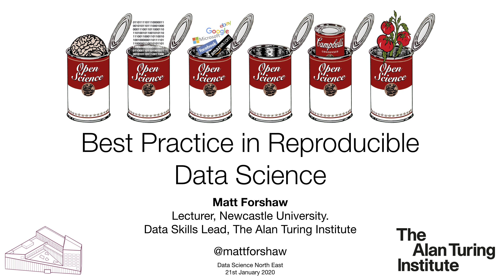

# Best Practice in Reproducible Data Science

Slide deck as [PDF](210120_DSNE.pdf).

## Links to Resources
- <a href="https://www.incf.org/activities/standards-and-best-practices/what-is-fair" target="_blank">FAIR Principles</a>: The FAIR principles are a set of community-developed guidelines to ensure that data or any digital object are Findable, Accessible, Interoperable and Reusable. The FAIR principles specifically emphasize enhancing the ability of machines to automatically find and use data or any digital object, and support its reuse by individuals. Standards for the description, interoperability, citation etc. are at the core of these principles.
- <a href="https://www.software.ac.uk/resources" target="_blank">Software Sustainability Institute</a> - excellent resources and blog posts centred around open science and software sustainability.
- <a href="https://carpentries.org/" target="_blank">Carpentries</a> - free training resources in version control, command-line scripting and other topics relating to reproducible research.
- <a href="https://the-turing-way.netlify.com/introduction/introduction" target="_blank">The Turing Way</a> - A handbook for reproducible data science

## Exercise Sheet and Dataset
Within the Quiz code, there are several threats to reproducibility.
[Quiz (PDF)](Quiz.pdf) - [Quiz (Source)](Quiz.Rmd)

[Urban Observatory `PER_EMOTE_2204`](https://newcastle.urbanobservatory.ac.uk/sensors/sensor/PER_EMOTE_2204_AIR/)

## Tutorial
[Reproducible data science techniques in actuarial work](https://philipdarke.com/reproducible-actuarial-work/), work with Philip Darke, offers an end-to-end tutorial going from data to reproducible Rmarkdown report, using `ProjectTemplate`.

## Questions, comments and suggestions
I would love to hear from you if you have any questions or comments. Please do not hesitate to contact me via email at matthew.forshaw@ncl.ac.uk or on [Twitter](https://twitter.com/mattforshaw).
